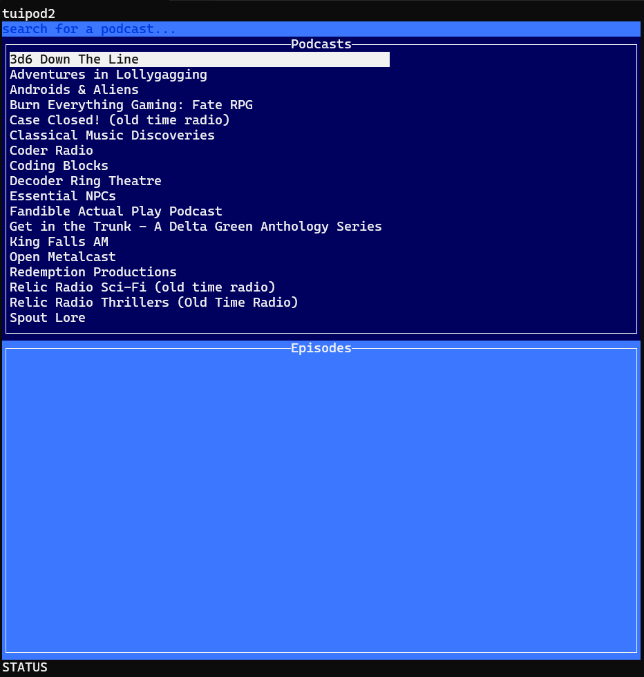

# tuipod2

Another TUI-based Podcast Player

## Overview

In the never-ending quest to find the "perfect" podcast player, I often try to create my own.

This particular endeavor follows an attempt in Python with Textual, and (very) brief dalliance with a Rust-based version.

This implementation strives to be Go all the way!

[More overview here...](docs/overview.md)

## Screenshots

## License

[MIT License](LICENSE)
