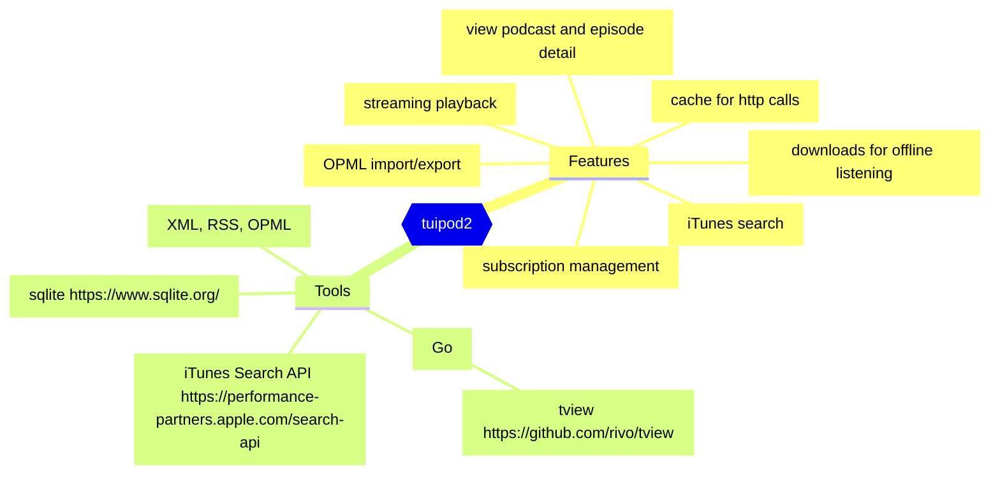

# tuipod2 Overview

tuidpod2 is a TUI-based podcast player.

## Ideas

```mermaid
mindmap
    root{{tuipod2}}
        Features
            [cache for http calls]
            [downloads for offline listening]
            [iTunes search]
            [OPML import/export]
            [streaming playback]
            [subscription management]
            [view podcast and episode detail]
        Tools
            [Go]
                [tview https://github.com/rivo/tview]
            [iTunes Search API https://performance-partners.apple.com/search-api]
            [sqlite https://www.sqlite.org/]
            [XML, RSS, OPML]
```
